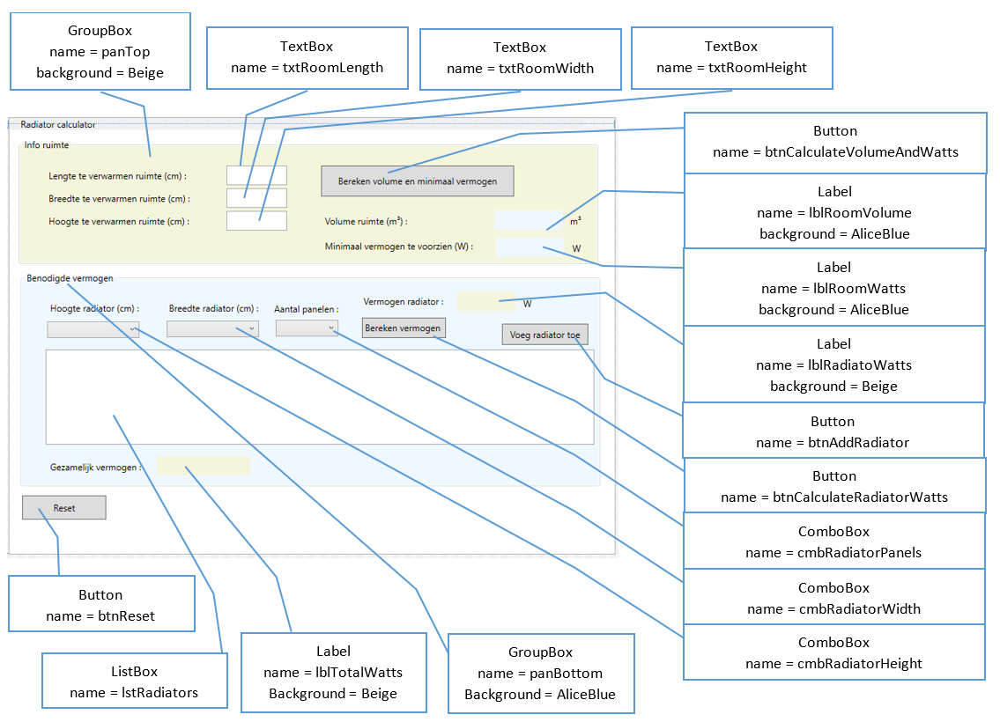

# PRB PE1 : Radiatoren

## Opdracht algemeen

Het is de bedoeling dat je een app maakt waarin je eerst kunt laten berekenen hoeveel Watt je nodig hebt om een gegeven ruimte (volgens lengte, breedte en hoogte) te gaan verwarmen.  Voor de eenvoud gaan we er van uit gaan dat je 50W nodig hebt om 1m³ te verwarmen.
Eenmaal dit berekend is bied je de gebruiker de mogelijkheid aan om radiators te kiezen.  
De gebruiker kiest de hoogte (50, 60, 70, 80, 90 of 100cm) en de breedte  (50, 60, 70, 80, 90 of 100cm) van een radiator alsook het aantal panelen waaruit het radiatorelement moet bestaan (1, 2 of 3 panelen).
Vervolgens kan aan de hand van de gekozen afmetingen en panel het vermogen van een paneel berekend worden.  Is de gebruiker tevreden met het geselecteerde model, dan wordt deze toegevoegd aan een lijst.  
Indien nodig kan de gebruiker nu een 2°, een 3° ... radiator selecteren en toevoegen aan de lijst.
Het totale vermogen van alle geselecteerde radiatoren samen wordt eveneens afgebeeld op het scherm.

Er is eveneens een knop voorzien om alles terug leeg te maken zodat men helemaal vanaf nul kan herbeginnen.

  

## Opdracht grafisch gedeelte

Haal deze (lege) starterscode binnen.  
Teken de controls zo goed als mogelijk na zoals in onderstaande afbeelding.  

  

Opgepast : er dienen 2 GroupBox controls op het venster geplaatst te worden (panTop en panBottom).  In beginsel kan je maar 1 control in een GroupBox plaatsen, tenzij je eerst in de GroupBox een Grid plaatst : pas als dat gebeurd is plaats je de andere controls in de GroupBox.  Zie XAML code fragment hieronder : 

  

Nadat je alle controls hebt aangemaakt, voorzie je waar nodig de nodige event handlers   
  * Winodw_Loaded 
  * BtnCalculateVolumAndWatts_Click
  * BtnCalculateRadiatorWatts_Click
  * CmbRadiatorHeight_SelectionChanged
  * CmbRadiatorWidth_SelectionChanged
  * CmbRadiatorPanels_SelectionChanged
  * BtnAddRadiator_Click
  * BtnReset_Click

## Opdracht code behind

Je plaatst uiteraard de nodige code in de event handlers maar daar waar aangewezen werk je zo veel als mogelijk met je eigen methodes.  
Bij de opstart zorg je er voor dat : 
  * de groupbox panTop is ingeschakeld, de groupbox panBottom is uitgeschakeld  
  * de comboboxen cmbRadiatorHeight en cmbRadiatorWidth gevuld worden met de waarden 50, 60, 70, 80, 90 en 100 en de combobox cmbRadiatorPanels gevuld wordt met de waarden 1, 2 en 3.  Maak hier bij voorkeur een afzonderlijke methode voor.    
  * je voorziet een methode om de controls txtRoomHeight, txtRoomLength, txtRoomWidth, lblRoomVolume, lblRoomWatts en lstRadiators leeg te maken.  Deze methode roep je op bij de start van je programma, maar eveneens wanneer op de knop btnReset wordt geklikt.  
  
Om het volume van een ruimte te bereken heb je deze formule nodig : lengte * breedte * hoogte / 1000000 (de deling is nodig omdat we vertrekken van cm maar we willen het volume in m³).  
Om het nodige vermogen in Watt uit te rekenen die je nodig hebt om de ruimte te kunnen verwarmen vermenigvuldig je het hierboven verkregen resultaat met 50 (50W/m³).  
  
Eenmaal het volume van de ruimte berekend werd en het nodige vermogen schakel je panTop uit en schakel je panBottom in.  
Bij aanvang is lblRadiatorWatts leeg en is btnAddRadiator onzichtbaar.
De gebruiker kiest de hoogt en breedt van de radiator alsook het aantal panelen.  Wordt er op de knop btnCalculateRadiatorWatts wordt geklikt bereken je het vermogen van de samengestelde radiator : (hoogt * breedte * aantal panelen) * 0.15  (een raditor levert maximaal 0.15W op per vierkante cm). Het resultaat wordt afgebeeld in lblRadiatorWatts en de knop btnAddRadiator wordt zichtbaar.   
Is de gebruiker niet tevreden met het resultaat dan kan hij een andere hoogte of breedte of ander aantal panelen selecteren : van zodra in één van de drie comboboxen een andere waarde wordt geselecteerd dien je lblRadiatorWatts trouwens leeg te maken en btnAddRadiator onzichtbaar te maken.  
Is de gebruiker wel tevreden dan kan hij op btnAddRadiator klikken.  De afmetingen van de radiator en zijn vermogen wordt toegevoegd als tekst aan de listbox lstRadiators en onderaan (in lblTotalWatts) verschijnt het vermogen van alle geselecteerde radiatoren samen.  

Klik de gebruiker op btnReset dan worden een aantal controls (txtRoomHeight, txtRoomLength, txtRoomWidth, lblRoomVolume, lblRoomWatts en lstRadiators) leeggemaakt, schakel je panTop weer in, en panBottom weer uit.
  
## Richtlijnen  

#### Minimumvereisten  
* Het gebruik van variabelen en methodes is verplicht (waar gepast).  

#### Wat is goede codekwaliteit?  
Goede codekwaliteit betekent goed gestructureerde code, goed gekozen variabelenamen, gebruik van aparte methodes waar nodig en het volgen van de C# naming conventions.   

#### Belangrijke opmerkingen  
  * **Indien de inputvelden blanco ingediend worden zal je applicatie hoogstwaarschijnlijk crashen. Hier worden géén punten voor afgetrokken.**  
  * Extra features toevoegen aan je oplossing mag, maar zorg er voor dat de bovenstaande minimum requirements zeker behaald worden. Extra inzet wordt beloond.  

 
